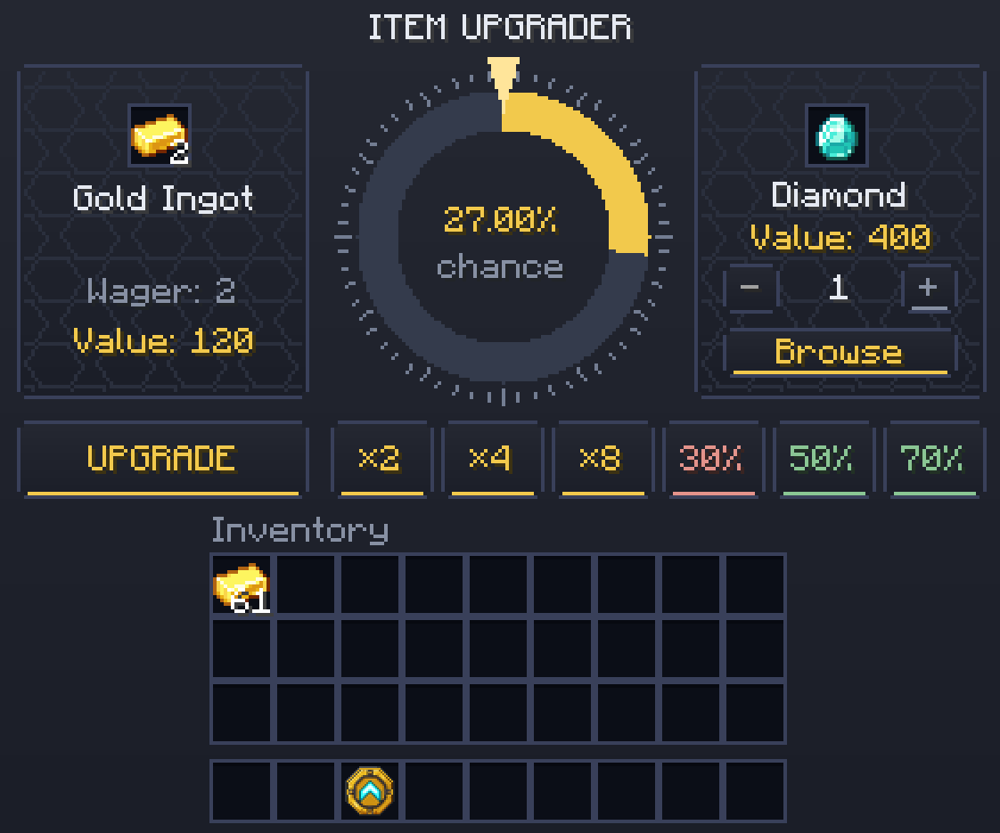
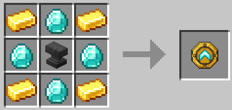

# Super Upgrader

[](https://minecraft.net/)
[](https://fabricmc.net/)
[](https://adoptium.net/)
[](#multilingual-support)
[](LICENSE)

A Fabric mod for Minecraft that introduces an item upgrade station. Place an item into the station, select a target item, and attempt an upgrade using an animated progression wheel based on relative material values.

Originally created by **EXEcheINZ** (*Upgrader* for Minecraft 1.21.11). Modernized and ported to **Minecraft 26.2 / Java 25** by **esezak**.



---

## Features

- **Animated Upgrade Station:** Portable station item that opens a custom interface with an animated upgrade wheel.
- **Dynamic Recipe Valuation:** Scans crafting, smelting, blasting, smoking, campfire, stonecutting, and smithing recipes to calculate item values from raw materials.
- **Rarity Fallbacks:** Automatically assigns estimated values to non-craftable items based on their vanilla rarity tier.
- **Durability Scaling:** Damaged gear scales in value with remaining durability (down to a 5% floor).
- **Searchable Target Browser:** Browse eligible items in a multi-column catalog with instant search, value displays, and real-time success rates.
- **Quick Presets:** Instant selection buttons for value multiples (2×, 4×, 8×) and target success rates (30%, 50%, 70%), with output quantity controls.
- **Bounded Success Rates:** Mathematical formula clamped between 0.1% and 90.0% to keep progression balanced.
- **Server-Authoritative:** All calculations and outcomes are handled by the server. Any interruption that closes the station during an upgrade immediately settles the existing result: wins pay out the target items to inventory or drop them at your feet; losses consume the wager with no refund. Only input items that have not been wagered are returned when closing the station.
- **Multilingual Support:** Includes native translations for 21 languages.
- **Configurable:** Adjust prices, multipliers, cooldowns, and blacklists via `config/superupgrader.json`.

---

## Crafting & Usage

### Recipe

The recipe unlocks automatically in your recipe book on your first world join, with no items or crafting required. Existing players also unlock it when they next join with the mod installed.

Craft the Super Upgrader with 4 Gold Ingots, 4 Diamonds, and an Anvil:




Hold the item and **right-click** to open the station.

---

### How to Upgrade

1. **Insert Item:** Place an item into the input slot. Its point value is calculated automatically.
2. **Select Target:** Click **Browse** to choose a target item from the catalog, or pick a preset button (2×, 50%, etc.).
3. **Set Quantity:** Use the **−** and **+** buttons to adjust how many target items you want to produce.
4. **Upgrade:** Press **UPGRADE** to begin.
5. **Outcome:** On success, the target item is placed in your inventory. On failure, the input stack is consumed.

> Note: The entire stack in the input slot is consumed during the attempt. Items in your regular inventory slots are unaffected.

---

### Presets & Controls

| Control | Description |
| --- | --- |
| **2× / 4× / 8×** | Selects a target item worth approximately 2×, 4×, or 8× the input value |
| **30% / 50% / 70%** | Selects a target item close to a 30%, 50%, or 70% success rate |
| **− / +** | Adjusts the target stack quantity |
| **Browse** | Opens the searchable catalog of valid items and success rates |

---

## Valuation & Success Rates

Points are appraisal values used to determine relative item worth and calculate success rates.

### Success Rate Formula

```math
\text{Success Chance} = \text{clamp}\left(0.90 \times \frac{\text{Input Value}}{\text{Target Value}}, 0.1\%, 90.0\%\right)
```

- **Minimum rate:** 0.1%
- **Maximum rate:** 90.0%
- **Conversion factor:** 0.90 baseline ratio

### Reference Values

| Item | Points |
| --- | ---: |
| Iron Ingot | 40 |
| Gold Ingot | 60 |
| Emerald | 140 |
| Diamond | 400 |
| Netherite Scrap | 1,200 |
| Netherite Ingot | 5,040 *(derived from 4 scrap + 4 gold)* |
| Elytra | 2,500 |
| Nether Star | 4,000 |
| Dragon Egg | 20,000 |

### Example Conversions

| Input Item | Target Item | Success Rate |
| --- | --- | ---: |
| 1 Iron Ingot | 1 Diamond | 9.0% |
| 4 Iron Ingots | 1 Diamond | 36.0% |
| 8 Iron Ingots | 1 Diamond | 72.0% |
| 4 Iron Ingots | 2 Diamonds | 18.0% |
| 1 Gold Ingot | 1 Netherite Scrap | 4.5% |
| 10 Diamonds | 1 Nether Star | 90.0% *(capped)* |

### Excluded Items

Certain items cannot be used as input or selected as targets:
- Potions, splash/lingering potions, and tipped arrows
- Spawn eggs
- Enchanted books
- Technical and unbreakable blocks (Bedrock, Command Blocks, Spawners, Barriers, etc.)
- The Super Upgrader station itself
- Any items listed in the configuration blacklist

---

## Configuration

The configuration file is located at `config/superupgrader.json`:

```json
{
  "valueOverrides": {},
  "globalValueMultiplier": 1.0,
  "valueMultipliers": {},
  "blacklist": [],
  "attemptCooldownSeconds": 0
}
```

| Setting | Type | Description |
| --- | --- | --- |
| `valueOverrides` | Map | Sets fixed prices for specific item IDs (e.g. `"minecraft:diamond": 500.0`), propagating to dependent recipes. |
| `globalValueMultiplier` | Number | Multiplies all calculated values by this factor (default: `1.0`). |
| `valueMultipliers` | Map | Scales specific item values after recipe calculation (e.g. `"minecraft:elytra": 2.0`). |
| `blacklist` | List | Item IDs excluded from both input and target lists. |
| `attemptCooldownSeconds` | Integer | Minimum cooldown in seconds between upgrade attempts (default: `0`). |

> Tip: Restart the game or server after editing `superupgrader.json`. Datapack recipe values can be reloaded in-game using `/reload`.

---

## Multilingual Support

Super Upgrader includes native translations for 21 languages:

- 🇬🇧 English (`en_us`)
- 🇷🇺 Russian (`ru_ru`)
- 🇹🇷 Turkish (`tr_tr`)
- 🇪🇸 Spanish — Spain (`es_es`) & Mexico (`es_mx`)
- 🇨🇳 Chinese — Simplified (`zh_cn`) & Traditional (`zh_tw`)
- 🇯🇵 Japanese (`ja_jp`)
- 🇫🇷 French — France (`fr_fr`) & Canada (`fr_ca`)
- 🇩🇪 German (`de_de`)
- 🇮🇹 Italian (`it_it`)
- 🇵🇱 Polish (`pl_pl`)
- 🇮🇳 Hindi (`hi_in`)
- 🇵🇹 Portuguese — Brazil (`pt_br`) & Portugal (`pt_pt`)
- 🇰🇷 Korean (`ko_kr`)
- 🇺🇦 Ukrainian (`uk_ua`)
- 🇳🇱 Dutch (`nl_nl`)
- 🇸🇪 Swedish (`sv_se`)
- 🇨🇿 Czech (`cs_cz`)

---

## Installation

1. Install **[Minecraft 26.2](https://minecraft.net/)**.
2. Install **[Fabric Loader](https://fabricmc.net/)** (version 0.19.0 or higher).
3. Ensure **Java 25** is installed.
4. Download the **Super Upgrader** JAR file and place it in your `.minecraft/mods` directory.
5. Ensure **[Fabric API](https://modrinth.com/mod/fabric-api)** is also installed in your `mods` folder.

---

## Credits & Acknowledgments

- **Original Creator:** **[EXEcheINZ](https://github.com/EXEcheINZ)**  
  Original author and designer of the *Upgrader* mod for Minecraft 1.21.11. All credit for the original design, station concept, and visual styling belongs to EXEcheINZ.
- **Port & Modernization:** **[esezak](https://github.com/esezak)**  
  Ported to Fabric Minecraft 26.2 and Java 25, featuring a clean-room implementation, dynamic recipe graph resolution, anti-cheat server networking, and 21 language localizations.

---

## Developer Guide

For technical documentation, code maps, build instructions, and architecture details, refer to **[AGENTS.md](AGENTS.md)**.

---

## License

This project is licensed under the terms of the **[MIT License](LICENSE)**.
